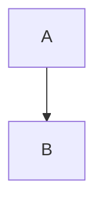

# Ununseptium Documentation

Welcome to the ununseptium documentation. This encyclopedia provides comprehensive reference material for the RegTech and Cybersecurity Python library.

## Scope

This documentation covers the ununseptium library's APIs, architecture, and usage patterns.

### Non-Goals

- Deployment infrastructure guidance (use your platform documentation)
- Regulatory interpretation (consult compliance professionals)
- Legal advice (consult legal professionals)

## Definitions

See [Glossary](glossary.md) for terminology definitions.

## Quick Navigation

| Section | Description |
|---------|-------------|
| [Table of Contents](toc.md) | Complete documentation index |
| [Glossary](glossary.md) | Terminology definitions |
| [FAQ](faq.md) | Frequently asked questions |
| [References](references.md) | Authoritative sources |

## Documentation by Category

### Architecture

| Document | Description |
|----------|-------------|
| [Overview](architecture/overview.md) | System architecture |
| [Data Flow](architecture/data-flow.md) | Data flow diagrams |
| [Plugin Architecture](architecture/plugin-architecture.md) | Plugin system design |
| [AI Pipeline](architecture/ai-pipeline.md) | ML/AI processing pipeline |

### Domain Modules

| Module | Documentation |
|--------|---------------|
| KYC | [KYC Overview](kyc/kyc-overview.md) |
| AML | [AML Overview](aml/aml-overview.md) |

### Security

| Document | Description |
|----------|-------------|
| [Overview](security/security-overview.md) | Security module overview |
| [Threat Model](security/threat-model.md) | Threat analysis |
| [Auditability](security/auditability.md) | Audit trail design |
| [Crypto](security/crypto-and-key-management.md) | Cryptography and keys |

### Mathematical Methods

| Document | Description |
|----------|-------------|
| [Overview](mathstats/mathstats-overview.md) | Statistical methods |
| [Uncertainty](mathstats/uncertainty.md) | Conformal prediction |
| [Sequential](mathstats/sequential.md) | Change detection |
| [EVT](mathstats/evt.md) | Extreme Value Theory |
| [Hawkes](mathstats/hawkes.md) | Point processes |
| [Graph Features](mathstats/graph-features.md) | Network analysis |

### AI and ML

| Document | Description |
|----------|-------------|
| [Overview](ai/ai-overview.md) | AI module overview |
| [SciML](ai/sciml.md) | Scientific ML |
| [Governance](ai/governance.md) | Model governance |

### Additional Resources

| Document | Description |
|----------|-------------|
| [Model Zoo](model-zoo/model-zoo.md) | Pretrained models |
| [Performance](performance/performance.md) | Benchmarks |
| [Legal Notices](legal/legal-notices.md) | Disclaimers |

## GitHub Rendering Notes

### Mermaid Diagrams

GitHub natively renders Mermaid diagrams in markdown files. Use fenced code blocks:

~~~markdown

~~~

See [GitHub Mermaid Documentation](https://docs.github.com/en/get-started/writing-on-github/working-with-advanced-formatting/creating-diagrams).

### LaTeX Math

GitHub supports LaTeX math rendering:

- Inline: `$E = mc^2$` renders as $E = mc^2$
- Block:
  
  ~~~markdown
  $$
  \int_0^\infty f(x) dx
  $$
  ~~~

See [GitHub Math Documentation](https://docs.github.com/en/get-started/writing-on-github/working-with-advanced-formatting/writing-mathematical-expressions).

## References

- [GitHub Documentation](https://docs.github.com/)
- [README](../README.md)
- [Contributing Guide](../CONTRIBUTING.md)
